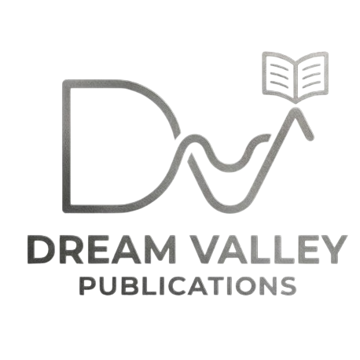

<p align="center">
  
</p>

<h1 align="center">Dream Valley Publications</h1>

<p align="center">
  <strong>Premium guided publishing for academics, institutions, and serious authors.</strong>
</p>

<p align="center">
  <a href="https://dreamvalleypublications.com">
    
  </a>
  
  
  
</p>

<br/>

<p align="center">
  
  
  
  
  
  
  
</p>

---

## ✨ Overview

**Dream Valley Publications** is a full-stack, premium publishing platform designed to help researchers, institutions, and expert authors move from manuscript submission to publication through a structured, transparent editorial workflow.

The platform is organized around **two service lanes**:

| Lane | For | Includes |
|------|-----|----------|
| 📚 **Academic Publishing** | Universities, researchers, journals & conference organizers | Thesis publishing, journal intake, structured review, metadata compliance |
| ✍️ **Author Publishing** | Expert authors, educators & consultants | Premium manuscript intake, positioning support, process milestones, launch-ready pages |

---

## 🏗️ Architecture

```
dream-valley-publications/
│
├── src/                    # Next.js 16 frontend (React 19)
│   ├── app/                # App Router with 20+ routes
│   │   ├── admin/          # Admin dashboard & management
│   │   ├── dashboard/      # Author submission dashboard
│   │   ├── publish/        # Submission intake workflow
│   │   ├── books/          # Public catalog & search
│   │   ├── services/       # Service lane pages
│   │   ├── api/            # API route handlers
│   │   └── ...             # About, Contact, Pricing, etc.
│   ├── components/         # Reusable UI components
│   ├── context/            # React Context providers
│   ├── hooks/              # Custom React hooks
│   └── lib/                # Utilities & site config
│
├── server/                 # Elysia.js backend (Bun runtime)
│   ├── index.ts            # API entry point
│   └── services/           # Firebase, Cloudinary integrations
│
└── public/                 # Static assets & branding
```

---

## 🚀 Tech Stack

### Frontend
- **Next.js 16** — App Router, Server Components, SSR/SSG
- **React 19** — Latest concurrent features & React Compiler
- **Ant Design 5** — Enterprise-grade component library
- **Framer Motion** — Fluid page transitions & micro-interactions
- **GSAP** — Scroll-triggered reveal animations
- **Lucide React** — Modern icon system

### Backend
- **Elysia.js** — High-performance TypeScript API framework
- **Bun** — Ultra-fast JavaScript runtime
- **Firebase Admin** — Authentication & user management
- **Cloudinary** — Media asset pipeline & optimization
- **Neon PostgreSQL** — Serverless database with branching

### Infrastructure
- **Docker** — Containerized deployment
- **GitHub Actions** — CI/CD pipeline
- **GCP** — Cloud deployment ready

---

## ⚡ Quick Start

### Prerequisites

- [Node.js 20+](https://nodejs.org/) or [Bun](https://bun.sh/)
- [Git](https://git-scm.com/)

### 1. Clone the repository

```bash
git clone https://github.com/iamharishrohith/Dream-Valley-Publications.git
cd Dream-Valley-Publications
```

### 2. Install dependencies

```bash
# Frontend
npm install

# Backend
cd server && bun install && cd ..
```

### 3. Configure environment

```bash
cp .env.example .env.local
cp server/.env.example server/.env
```

Fill in your credentials for Neon, Firebase, and Cloudinary.

### 4. Run the development servers

```bash
# Terminal 1 — Frontend (Next.js)
npm run dev

# Terminal 2 — Backend (Elysia)
npm run server
```

Open **http://localhost:3000** to see the platform.

---

## 🎨 Features

<table>
  <tr>
    <td align="center">🌙</td>
    <td><strong>Dark/Light Mode</strong><br/>Automatic theme detection with manual toggle</td>
    <td align="center">🔍</td>
    <td><strong>Smart Search</strong><br/>Autocomplete search across the published catalog</td>
  </tr>
  <tr>
    <td align="center">📝</td>
    <td><strong>Submission Workflow</strong><br/>Guided multi-step intake for manuscripts</td>
    <td align="center">🛡️</td>
    <td><strong>Admin Panel</strong><br/>Full submission management & editorial controls</td>
  </tr>
  <tr>
    <td align="center">📊</td>
    <td><strong>Author Dashboard</strong><br/>Track submission status in real-time</td>
    <td align="center">📰</td>
    <td><strong>Newsletter</strong><br/>Integrated subscription for publishing updates</td>
  </tr>
  <tr>
    <td align="center">🖼️</td>
    <td><strong>Cloudinary Media</strong><br/>Optimized image delivery with blur placeholders</td>
    <td align="center">🎯</td>
    <td><strong>SEO Optimized</strong><br/>Schema.org markup, sitemap, OpenGraph, meta tags</td>
  </tr>
</table>

---

## 📜 Scripts

| Command | Description |
|---------|-------------|
| `npm run dev` | Start Next.js development server |
| `npm run build` | Production build |
| `npm run start` | Start production server |
| `npm run server` | Start Elysia backend (Bun) |
| `npm run smoke` | Run smoke checks |
| `npm run verify:flows` | Validate publishing flow integrity |
| `npm run verify:env` | Check environment configuration |

---

## 🗂️ Environment Variables

Create `.env.local` and `server/.env` from their `.example` templates:

| Variable | Purpose |
|----------|---------|
| `NEXT_PUBLIC_API_URL` | Backend API endpoint |
| `NEXT_PUBLIC_SITE_URL` | Public site URL |
| `DATABASE_URL` | Neon PostgreSQL connection string |
| `NEON_PROJECT_ID` | Neon project identifier |
| Firebase credentials | Authentication & user management |
| Cloudinary credentials | Media upload & optimization |

---

## 🤝 Contributing

Contributions, issues, and feature requests are welcome!

1. Fork the repository
2. Create your feature branch (`git checkout -b feature/amazing-feature`)
3. Commit your changes (`git commit -m 'Add amazing feature'`)
4. Push to the branch (`git push origin feature/amazing-feature`)
5. Open a Pull Request

---

## 📄 License

This project is proprietary software developed for **Dream Valley Publications**.

---

<p align="center">
  <sub>Built with ❤️ by the Dream Valley Publications team</sub>
</p>
